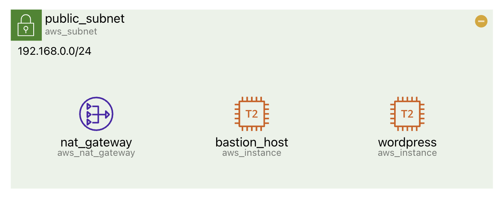
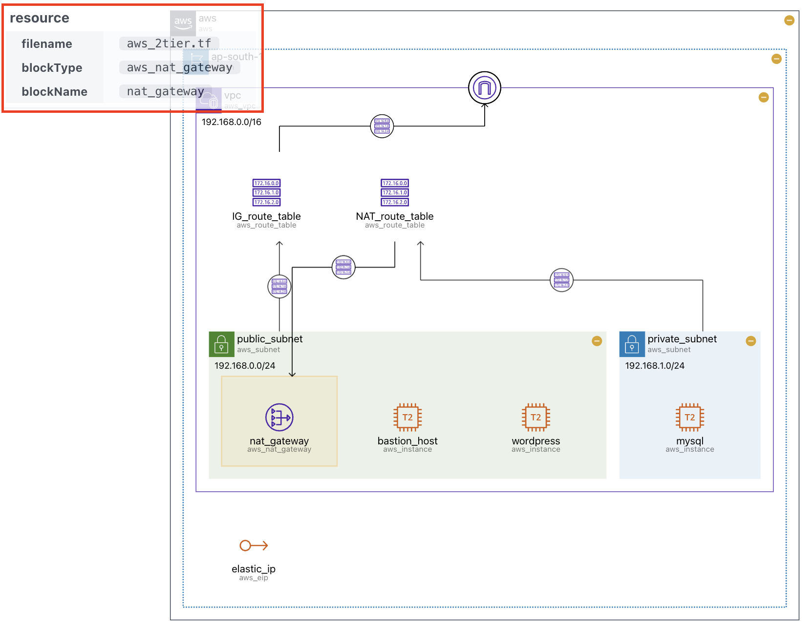
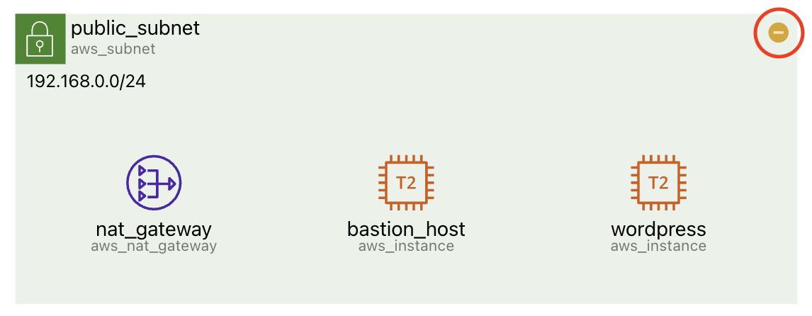

# Diagram

## 리소스 {#resource}

다이어그램은 리소스 간의 포함관계와 연결관계를 반영하여 그려집니다.

각 리소스는 기본적으로 아래와 같은 정보를 함께 표시합니다.

- **리소스의 아이콘**
- **리소스의 이름** (`terraform`의 block name)
- **리소스의 타입** (`terraform`의 block type)
- `terraform`에 특정 정보가 있을 경우, 함께 표시됩니다. (e.g. `cidr`)

:::note

**사이드바의 설정탭**에서 보고 싶은 정보를 `on/off` 할 수 있습니다.

:::

### 툴팁 {#tooltip}

커서를 리소스에 두면 화면 좌측 상단에 `tooltip`이 나타납니다.

:::note

**사이드바의 설정탭**에서 툴팁을 `on/off` 할 수 있습니다.

:::

### 리소스 요약 {#summarize}

**그룹 리소스**의 경우 해당 리소스의 좌측 상단의 `-`, `+` 버튼을 클릭해 하위 리소스를 **요약하거나 요약 해제**할 수 있습니다.

