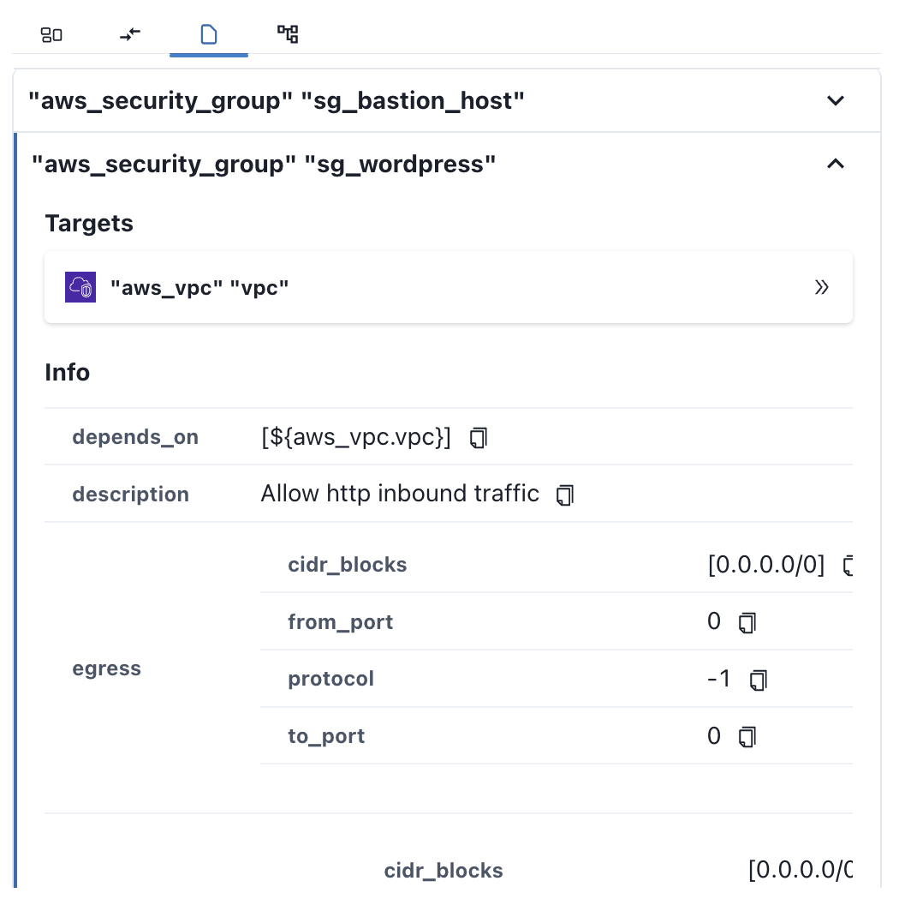

# Blocks

다이어그램 **리소스**와 **정책**들의 **상세 정보**를 제공합니다.

**Blocks**탭은 아래와 같은 4개의 탭으로 이루어져 있습니다.

| 탭                                | 기능                                           |
| --------------------------------- | ---------------------------------------------- |
| [Nodes](#nodes-connections)       | 다이어그램에 표시되는 리소스들의 상세 정보     |
| [Connections](#nodes-connections) | 다이어그램에 표시되는 Connection들의 상세 정보 |
| [Policy](#policy)                 | 코드에 존재하는 정책(e.g. security group)      |
| [Tree View](#tree-view)           | 다이어그램에 표시되는 리소스들의 트리 뷰       |

## Nodes & Connections {#nodes-connections}

**Nodes**탭과 **Connections**탭에서 각 리소스의 상세 정보를 확인할 수 있습니다.

- **Nodes**탭은 다이어그램에 표시되는 노드들의 포함합니다.
- **Connections**탭은 다이어그램에 표시되는 노드들의 연결 관계를 포함합니다.

  

- 리소스 리스트의 각 항목에 **커서**를 두면 해당 리소스는 `hover` 상태가 됩니다. `hover` 상태의 리소스는 **다이어그램**과 **사이드바** 양쪽에서 **노란색**으로 **하이라이트** 됩니다. **다이어그램**의 리소스에 **커서**를 둔 경우에도 양쪽의 리소스가 **하이라이트** 됩니다.

  

- 리소스 리스트의 각 항목을 **클릭**할 경우, 해당 리소스는 `선택` 상태가 됩니다. `선택` 상태의 리소스는 **다이어그램**과 **사이드바** 양쪽에서 **파란색**으로 하이라이트 됩니다. **다이어그램**의 리소스를 **클릭**를 둔 경우에도 양쪽의 리소스가 **하이라이트** 됩니다.
  

리소스 리스트 각 항목의 **우측 버튼**를 클릭하면 **리소스 세부 정보**를 확인할 수 있습니다.

## Policy {#policy}

클라우드 인프라를 운영하면서 설정한 **정책**(_e.g. `security group`_)의 **설정 사항**, 정책의 **적용 범위** 등을 확인할 수 있습니다.

  

정책 리스트 각 항목의 **우측 버튼**을 클릭하면 **정책 세부 정보** 확인이 가능합니다.

세부정보의 **Targets**에서 해당 정책이 적용되는 리소스를 확인할 수 있습니다. **Target**의 항목을 클릭할 경우, 해당 **Target**이 `선택` 상태가 되어 다이어그램에 **하이라이트** 됩니다.

## Tree View {#tree-view}

다이어그램에 표시되는 노드들의 **포함 관계**를 **트리뷰**로 제공합니다.

