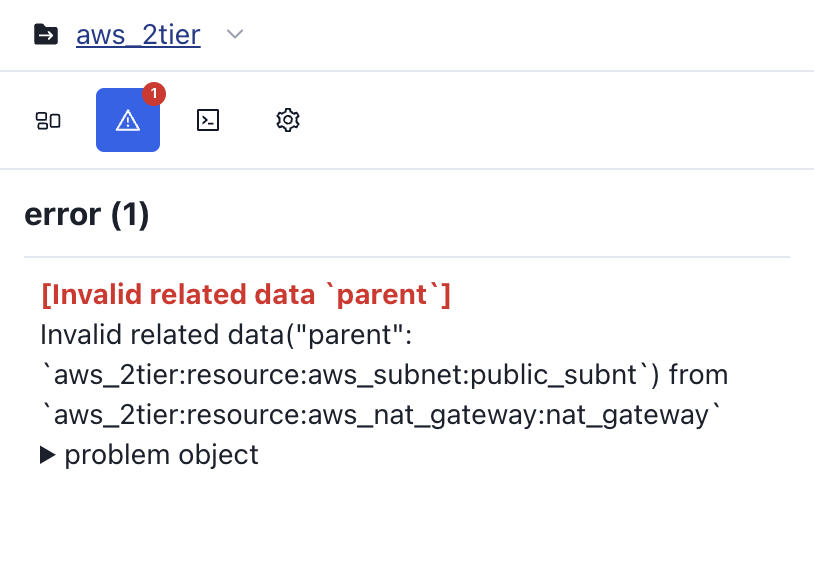

# Errors

시각화 과정에서 발생한 **오류** 정보를 제공합니다.

코드를 시각화하는 중 **지원되지 않는 리소스**가 있거나, **연결 관계 설정에 문제**가 발생하는 경우 에러 탭에 해당 오류가 표시됩니다.

**문제 객체 토글**을 통해 오류가 발생한 객체의 **상세 정보**를 확인할 수 있습니다.

혹시나 서비스 상의 문제를 발견하시면 아래 채널들을 통해 **문제사항을 제보해주세요**!

- [Google Form](https://docs.google.com/forms/d/e/1FAIpQLSdeEh-iAg92AAS1Y1PMh0NUk-aenlotQml7wILaBOIUjGKYyg/viewform?usp=send_form)
- [Git Discussion](https://github.com/orgs/InitCloud-co/discussions/categories/-iacdog)
- [Mail](mailto:contact@initcloud.io)
- [카카오톡](https://open.kakao.com/o/sSyWwDef)

**여러분의 제보는 더 유용한 서비스를 만드는데 도움이 됩니다.**
