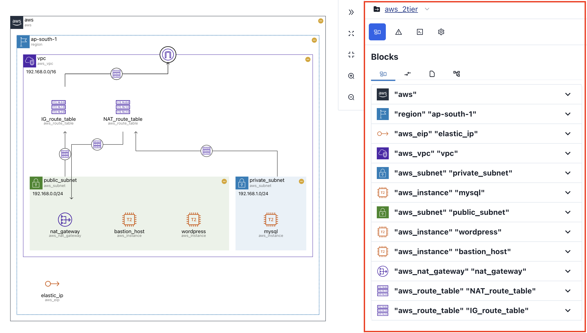
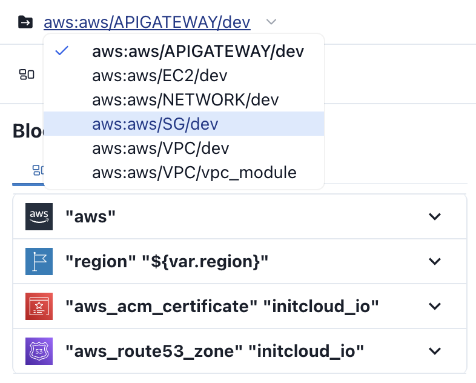

# 사이드바

**사이드바**는 **다이어그램**과 **인터랙티브**하게 작동합니다.

## 모듈 선택 {#select-module}

업로드한 `terraform` 모듈이 **다중 모듈**일 경우, **사이드바 상단**에서 원하는 **모듈을 선택**할 수 있습니다.

## Tabs {#tabs}

4개의 탭이 제공되며, 각 기능은 다음과 같습니다.

| 탭                     | 기능                                           |
| ---------------------- | ---------------------------------------------- |
| [Blocks](./blocks)     | 다이어그램 리소스의 상세 정보를 제공합니다.    |
| [Errors](./errors)     | 시각화 과정에서 발생한 오류 정보를 제공합니다. |
| [Code](./code)         | 업로드한 테라폼 모듈의 코드를 제공합니다.      |
| [Settings](./settings) | 다이어그램과 관련한 다양한 설정을 제공합니다.  |
