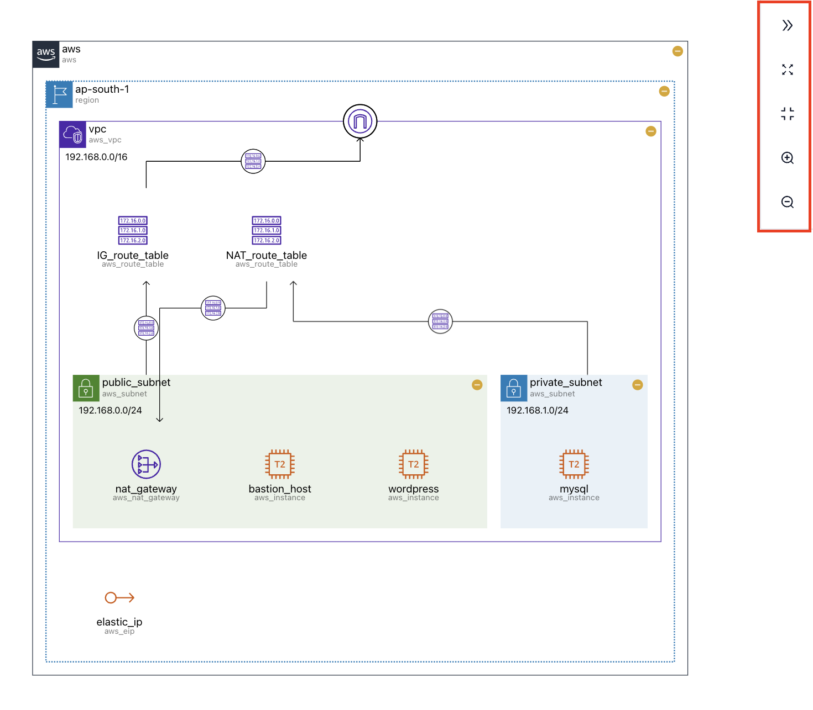

# Toolbar

우측의 **toolbar**를 통해 다이어그램을 **네비게이팅**할 수 있습니다.

각 버튼의 기능은 다음과 같습니다.

| 버튼                                                                                                                                                                                                                                                                                                                                                                                                                                                                                                                                                                                                                                                                                                                                                                                                                                                                                                                                                                                                                | 기능                     |
| ------------------------------------------------------------------------------------------------------------------------------------------------------------------------------------------------------------------------------------------------------------------------------------------------------------------------------------------------------------------------------------------------------------------------------------------------------------------------------------------------------------------------------------------------------------------------------------------------------------------------------------------------------------------------------------------------------------------------------------------------------------------------------------------------------------------------------------------------------------------------------------------------------------------------------------------------------------------------------------------------------------------- | ------------------------ |
| <svg stroke="currentColor" fill="currentColor" stroke-width="0" viewBox="0 0 1024 1024" height="1em" width="1em" xmlns="http://www.w3.org/2000/svg"><path d="M533.2 492.3L277.9 166.1c-3-3.9-7.7-6.1-12.6-6.1H188c-6.7 0-10.4 7.7-6.3 12.9L447.1 512 181.7 851.1A7.98 7.98 0 0 0 188 864h77.3c4.9 0 9.6-2.3 12.6-6.1l255.3-326.1c9.1-11.7 9.1-27.9 0-39.5zm304 0L581.9 166.1c-3-3.9-7.7-6.1-12.6-6.1H492c-6.7 0-10.4 7.7-6.3 12.9L751.1 512 485.7 851.1A7.98 7.98 0 0 0 492 864h77.3c4.9 0 9.6-2.3 12.6-6.1l255.3-326.1c9.1-11.7 9.1-27.9 0-39.5z"></path></svg>                                                                                                                                                                                                                                                                                                                                                                                                                                                    | 사이드바 토글            |
| <svg stroke="currentColor" fill="currentColor" stroke-width="0" viewBox="0 0 1024 1024" height="1em" width="1em" xmlns="http://www.w3.org/2000/svg"><path d="M290 236.4l43.9-43.9a8.01 8.01 0 0 0-4.7-13.6L169 160c-5.1-.6-9.5 3.7-8.9 8.9L179 329.1c.8 6.6 8.9 9.4 13.6 4.7l43.7-43.7L370 423.7c3.1 3.1 8.2 3.1 11.3 0l42.4-42.3c3.1-3.1 3.1-8.2 0-11.3L290 236.4zm352.7 187.3c3.1 3.1 8.2 3.1 11.3 0l133.7-133.6 43.7 43.7a8.01 8.01 0 0 0 13.6-4.7L863.9 169c.6-5.1-3.7-9.5-8.9-8.9L694.8 179c-6.6.8-9.4 8.9-4.7 13.6l43.9 43.9L600.3 370a8.03 8.03 0 0 0 0 11.3l42.4 42.4zM845 694.9c-.8-6.6-8.9-9.4-13.6-4.7l-43.7 43.7L654 600.3a8.03 8.03 0 0 0-11.3 0l-42.4 42.3a8.03 8.03 0 0 0 0 11.3L734 787.6l-43.9 43.9a8.01 8.01 0 0 0 4.7 13.6L855 864c5.1.6 9.5-3.7 8.9-8.9L845 694.9zm-463.7-94.6a8.03 8.03 0 0 0-11.3 0L236.3 733.9l-43.7-43.7a8.01 8.01 0 0 0-13.6 4.7L160.1 855c-.6 5.1 3.7 9.5 8.9 8.9L329.2 845c6.6-.8 9.4-8.9 4.7-13.6L290 787.6 423.7 654c3.1-3.1 3.1-8.2 0-11.3l-42.4-42.4z"></path></svg> | 전체화면 토글            |
| <svg stroke="currentColor" fill="currentColor" stroke-width="0" t="1569683667781" viewBox="0 0 1024 1024" version="1.1" height="1em" width="1em" xmlns="http://www.w3.org/2000/svg"><defs></defs><path d="M326 664H104c-8.8 0-16 7.2-16 16v48c0 8.8 7.2 16 16 16h174v176c0 8.8 7.2 16 16 16h48c8.8 0 16-7.2 16-16V696c0-17.7-14.3-32-32-32zM342 88h-48c-8.8 0-16 7.2-16 16v176H104c-8.8 0-16 7.2-16 16v48c0 8.8 7.2 16 16 16h222c17.7 0 32-14.3 32-32V104c0-8.8-7.2-16-16-16zM920 664H698c-17.7 0-32 14.3-32 32v224c0 8.8 7.2 16 16 16h48c8.8 0 16-7.2 16-16V744h174c8.8 0 16-7.2 16-16v-48c0-8.8-7.2-16-16-16zM920 280H746V104c0-8.8-7.2-16-16-16h-48c-8.8 0-16 7.2-16 16v224c0 17.7 14.3 32 32 32h222c8.8 0 16-7.2 16-16v-48c0-8.8-7.2-16-16-16z"></path></svg>                                                                                                                                                                                                                                                   | 다이어그램을 화면에 맞춤 |
| <svg stroke="currentColor" fill="currentColor" stroke-width="0" viewBox="0 0 1024 1024" height="1em" width="1em" xmlns="http://www.w3.org/2000/svg"><path d="M637 443H519V309c0-4.4-3.6-8-8-8h-60c-4.4 0-8 3.6-8 8v134H325c-4.4 0-8 3.6-8 8v60c0 4.4 3.6 8 8 8h118v134c0 4.4 3.6 8 8 8h60c4.4 0 8-3.6 8-8V519h118c4.4 0 8-3.6 8-8v-60c0-4.4-3.6-8-8-8zm284 424L775 721c122.1-148.9 113.6-369.5-26-509-148-148.1-388.4-148.1-537 0-148.1 148.6-148.1 389 0 537 139.5 139.6 360.1 148.1 509 26l146 146c3.2 2.8 8.3 2.8 11 0l43-43c2.8-2.7 2.8-7.8 0-11zM696 696c-118.8 118.7-311.2 118.7-430 0-118.7-118.8-118.7-311.2 0-430 118.8-118.7 311.2-118.7 430 0 118.7 118.8 118.7 311.2 0 430z"></path></svg>                                                                                                                                                                                                                                                                                                              | 다이어그램 확대          |
| <svg stroke="currentColor" fill="currentColor" stroke-width="0" viewBox="0 0 1024 1024" height="1em" width="1em" xmlns="http://www.w3.org/2000/svg"><path d="M637 443H325c-4.4 0-8 3.6-8 8v60c0 4.4 3.6 8 8 8h312c4.4 0 8-3.6 8-8v-60c0-4.4-3.6-8-8-8zm284 424L775 721c122.1-148.9 113.6-369.5-26-509-148-148.1-388.4-148.1-537 0-148.1 148.6-148.1 389 0 537 139.5 139.6 360.1 148.1 509 26l146 146c3.2 2.8 8.3 2.8 11 0l43-43c2.8-2.7 2.8-7.8 0-11zM696 696c-118.8 118.7-311.2 118.7-430 0-118.7-118.8-118.7-311.2 0-430 118.8-118.7 311.2-118.7 430 0 118.7 118.8 118.7 311.2 0 430z"></path></svg>                                                                                                                                                                                                                                                                                                                                                                                                              | 다이어그램 축소          |

:::tip

화면에 다이어그램이 보이지 않을 경우, **세번째 버튼**을 눌러 보세요. **zoom 설정**이 제대로 이루어지지 않았을 수 있습니다.

:::
