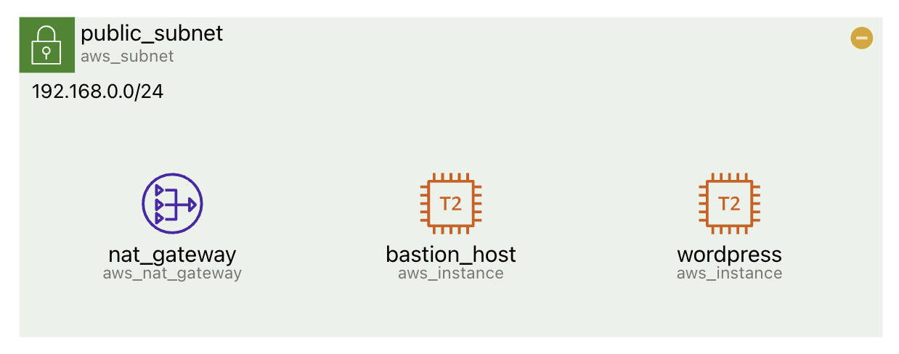

# Diagram

Provide the static `terraform` code as a diagram.

## Resource {#resource}

The diagram is drawn to reflect the inclusion and association relationships between resources.

By default, each resource displays the following information together

- **The icon of the resource**
- **The name of the resource** (block name in `terraform`)
- **The resource's type** (block type from `terraform`)
- If there is specific information in the `terraform` code, it will be displayed as well (_e.g. `cidr`_)

:::note

You can turn `on/off` the information you want to see in the **Settings tab in the sidebar**.

:::

### Tooltip {#tooltip}

When you hover your cursor over a resource, a `tooltip` appears in the upper left corner of the screen.

:::note

\*\*You can turn the tooltip `on/off` in the Settings tab in the sidebar.

:::

### Summarize resource {#summarize}

For **group resources**, you can **summarize or un-summarize** child resources by clicking the `-`, `+` buttons in the top left corner of the resource.

