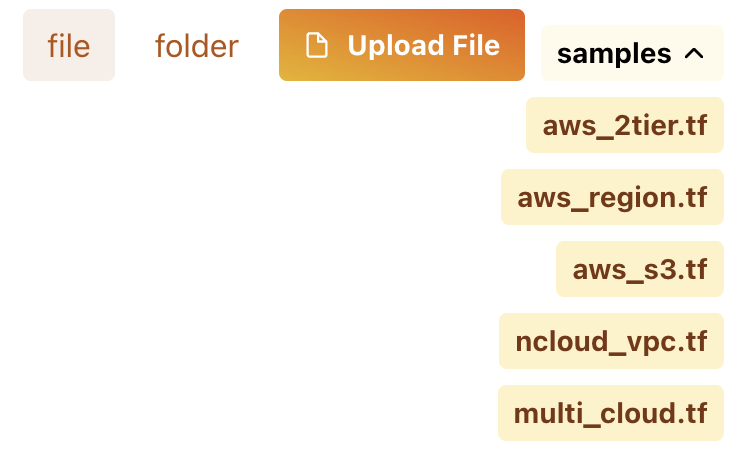
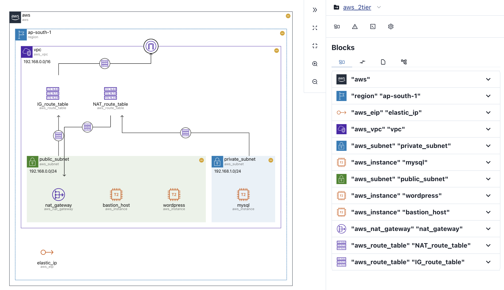

# Run Visualization

Experience fast, readable static code visualization.

## Go to IaCDOG {#goto-iacdog}

import { DocsLogo } from "@site/src/components/DocsLogo";

<DocsLogo />

Access the [IaCDOG](https://www.initcloud.io/iacdog/visualizer).

You can start using the service right away **without logging in**.

## Upload your terraform module {#upload-your-terraform-module}

Please upload your `terraform` module (single file or folder).

- Select `file` for **single file** or `folder` for **folder**.
- The **sample files** will show you different visualization results.

## Get your visualization result {#get-your-visualize-result}

- A **diagram** of the `terraform` structure is provided, along with a **sidebar** for more information.
- The **diagram** and **sidebar** are **interactive** with each other, allowing you to view resource information at your convenience.
