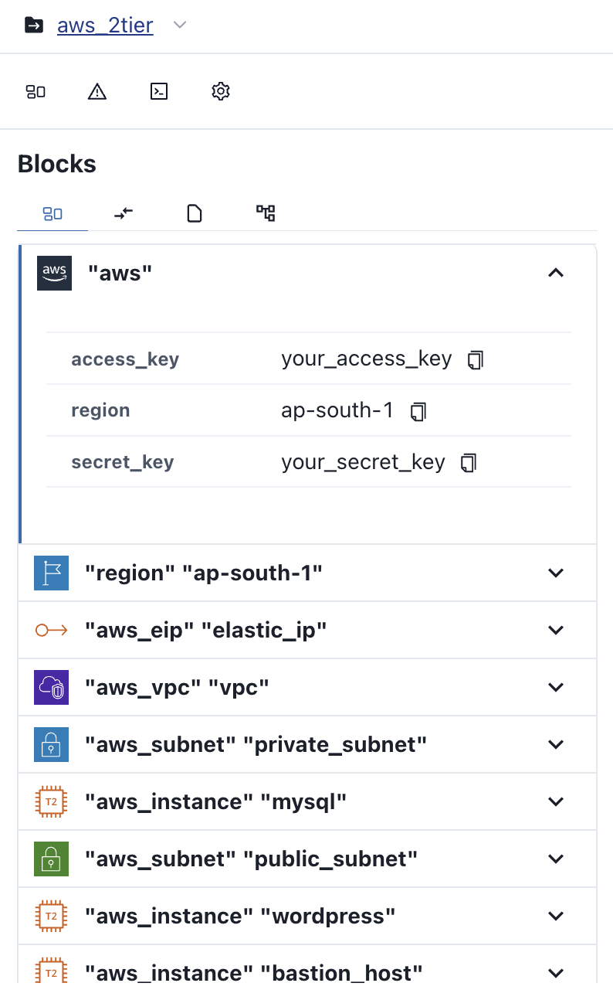
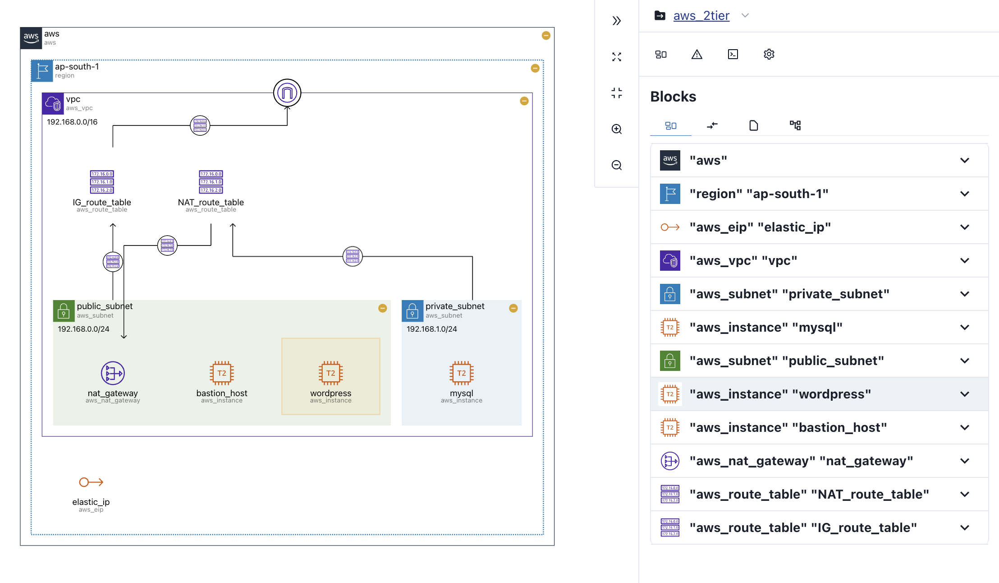
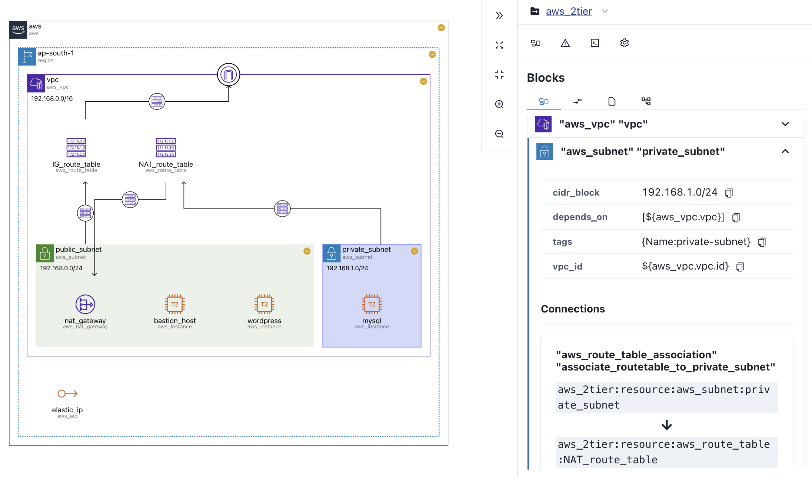
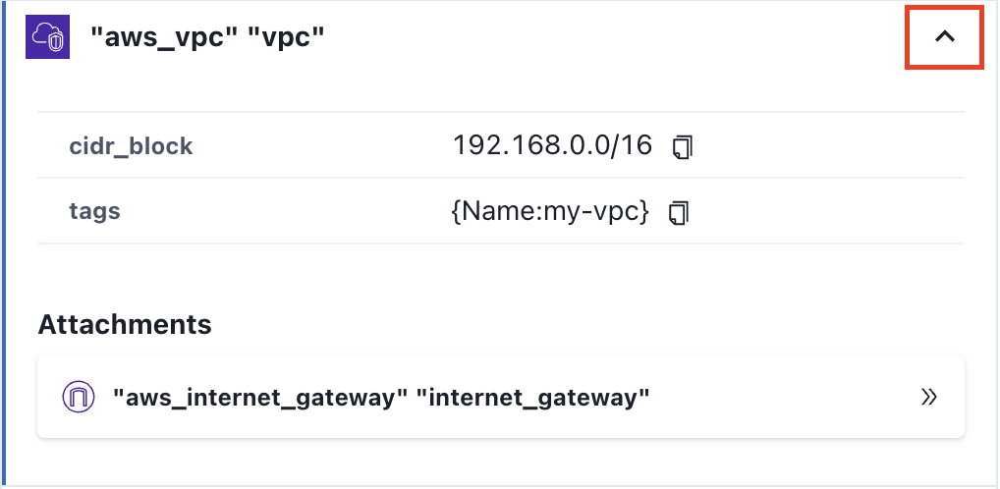
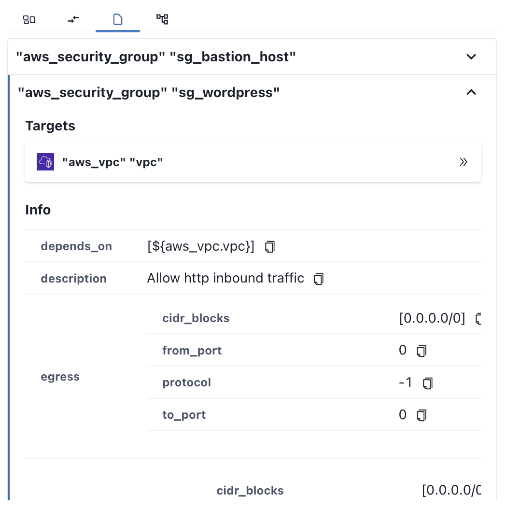
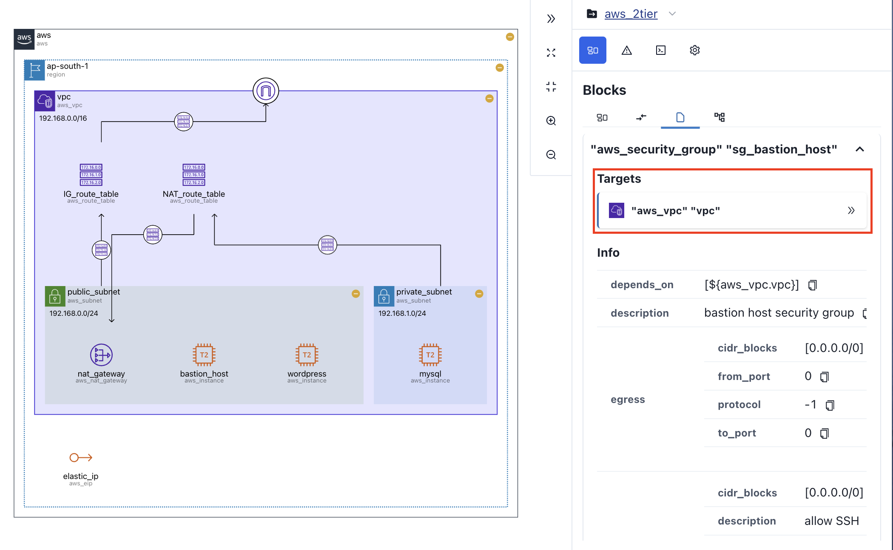
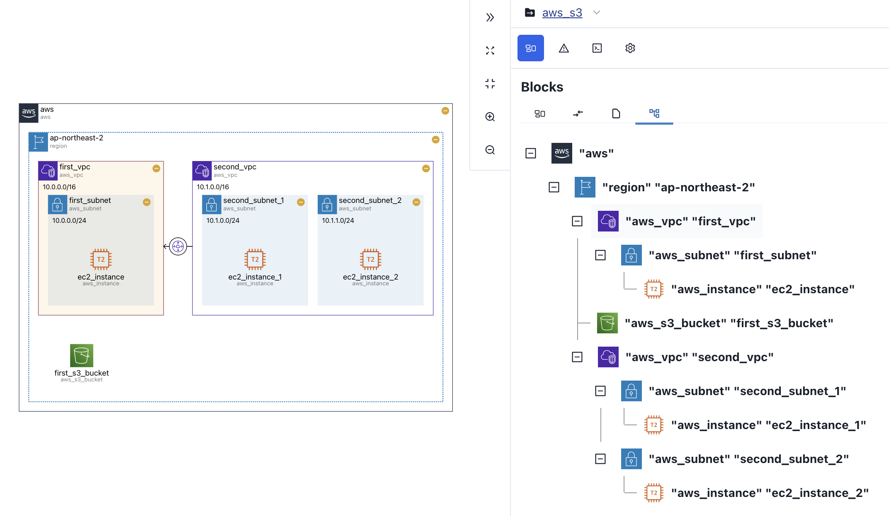

# Blocks Tab

The Blocks tab provides detailed information about diagram **resources** and **policies**.

The **Blocks** tab is organized into four tabs, including:

| tab                               | features                                                  |
| --------------------------------- | --------------------------------------------------------- |
| [Nodes](#nodes-connections)       | Detail information of resources in the diagram            |
| [Connections](#nodes-connections) | Detail information of connections in the diagram          |
| [Policy](#policy)                 | Detail information of policies in your `terraform` module |
| [Tree View](#tree-view)           | Tree view of resources in the diagram                     |

## Nodes & Connections {#nodes-connections}

You can get detail information of resources in **Nodes** tab and **Connections** tab.

- **Nodes** tab contains nodes in diagarm.
- **Connections** tab contains connections of nodes in diagarm.

  

- If you **hover** on resource list's item, the resource will set to `hover` state. Resource with `hover` state will be **highlighted** to **yellow** in both **sidebar** and **diagram**. It will work the same if you put your **hover** on diagram.

  

- If you **click** on resource list's item, the resource will set to `selected` state. Resource with `seleced` state will be **highlighted** to **blue** in both **sidebar** and **diagram**. It will work the same if you put your **click** on diagram.

  

By clicking resource list's item **left side button**, you can get **detail resource information**.

## Policy {#policy}

In Policy tab, you can view **settings** or **applied area** of **policy**(_e.g. `security group`_) set in your code.

  

By clicking policy list's item **left side button**, you can get **detail policy information**.

In the detail policy information, you can see **Targets** to know which resource the policy is applied. It the **Target**'s state is set to `selected`, it will be **highlighted** in the diagram.

## Tree View {#tree-view}

Tree view tab provides tree view of nodes in diagram.

