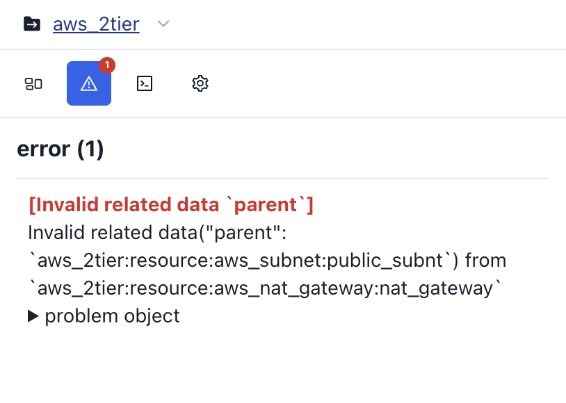
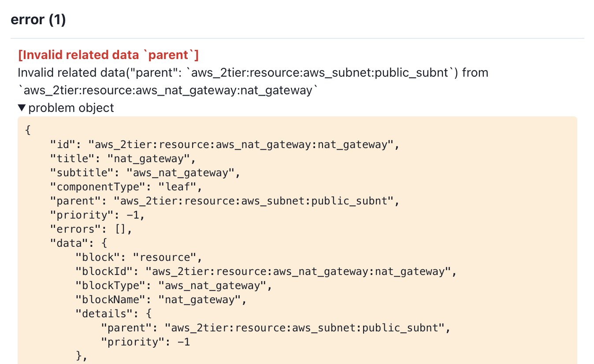

# Errors Tab

Provides information about **errors** that occurred during the visualization process.

If it encountered an **unsupported resource** while visualizing your code, or if it encountered a **problem setting up a connection relationship**, you'll see that error on the Errors tab.

The **Problem Object toggle** allows you to see **more details** about the object that caused the error.

If you find any issues with the service, please report them through the channels below!

- [Google Form](https://docs.google.com/forms/d/e/1FAIpQLSdeEh-iAg92AAS1Y1PMh0NUk-aenlotQml7wILaBOIUjGKYyg/viewform?usp=send_form)
- [Git Discussion](https://github.com/orgs/InitCloud-co/discussions/categories/-iacdog)
- [Mail](mailto:contact@initcloud.io)
- [Kakao Talk](https://open.kakao.com/o/sSyWwDef)

**Your reports help us build a more useful service**.
