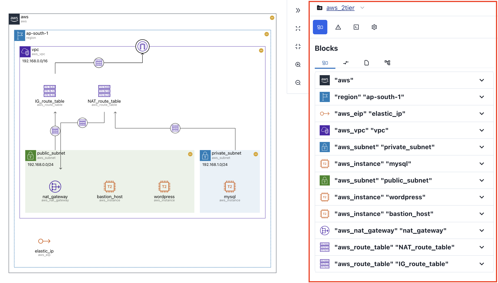
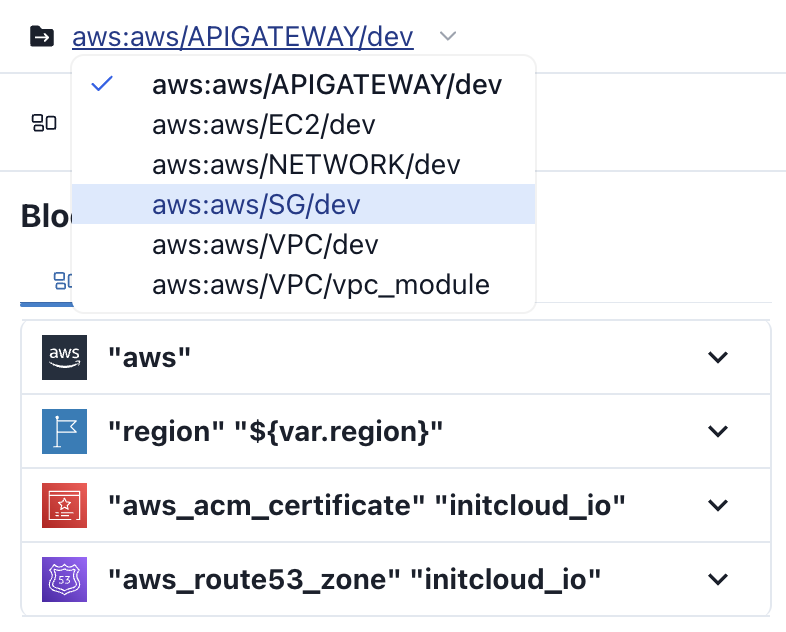

# Sidebar

The **sidebar** works **interactively** with the **diagram**.

## Module Selection {#module-selection}

If the `terraform` module you uploaded is **multi-module**, you can select the desired module at the top of the sidebar.

## Tabs {#tabs}

There are four tabs, each with the following features

| tab                    | feature                                                                           |
| ---------------------- | --------------------------------------------------------------------------------- |
| [Blocks](./blocks)     | Provides details of the diagram resource.                                         |
| [Errors](./errors)     | Provides information about errors that occurred during the visualization process. |
| [Code](./code)         | Provide the code for the terraform module you uploaded.                           |
| [Settings](./settings) | Provides various settings related to diagrams.                                    |
