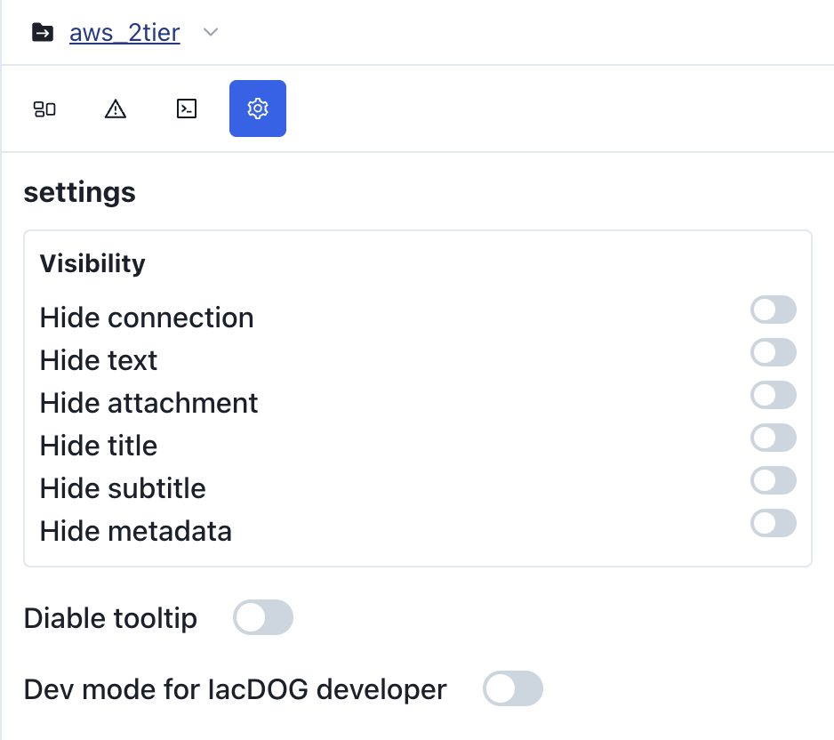
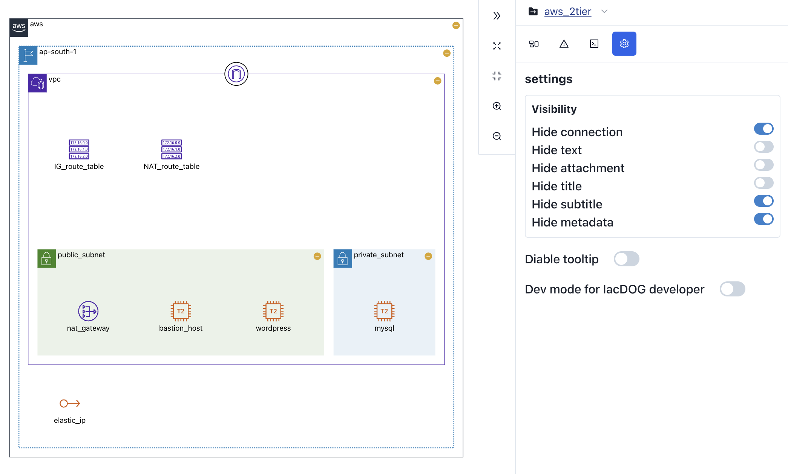
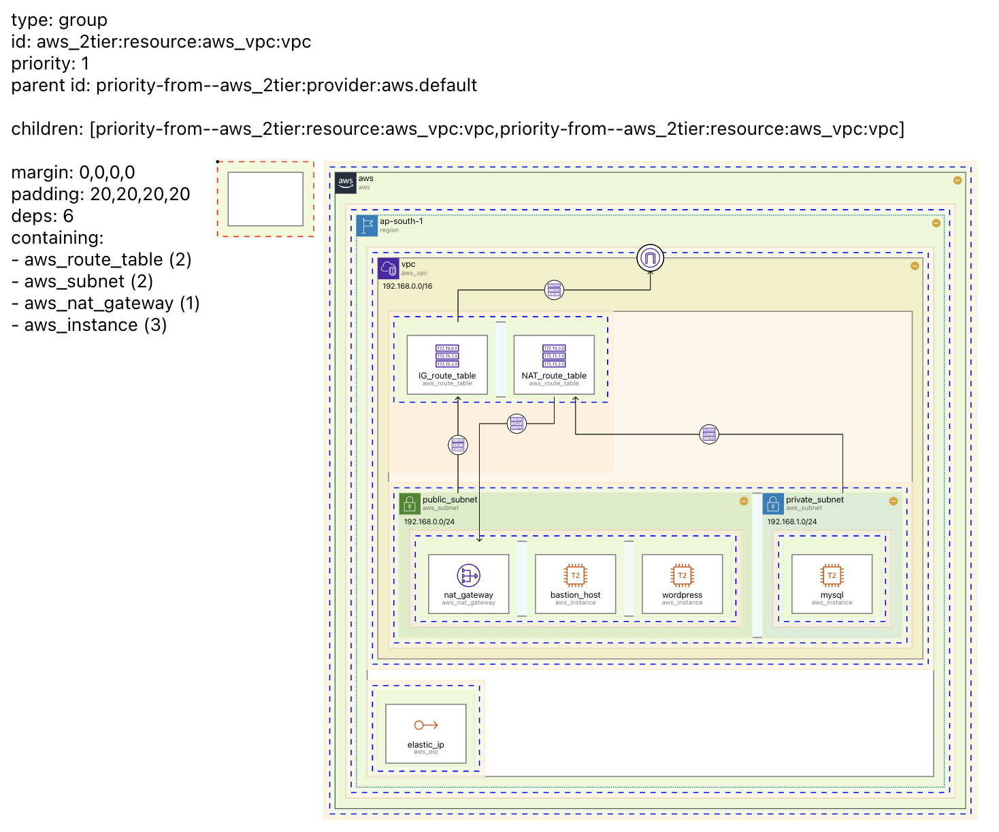

# Settings Tab

**Settings tab** provides various **configurations** related to the diagram.

  

## Visibility {#visibility}

The **Visibility** setting allows you to hide various information in the diagram.

## Disbale Tooltip {#disable-tooltip}

**Enable** or **disable** **tooltips**.

## Dev mode for IacDOG developer {#dev-mode-for-iacdog-developer}

This is the `dev` mode used during the development of `IaCDOG`.

When enabled, all nodes that are created for alignment during the visualization process will be shown. Hovering over each node will display the relevant details.

:::info

IaCDOG is still an **actively developed project**. The `dev` mode will be removed once development is stabilized. Have fun with it!

:::
