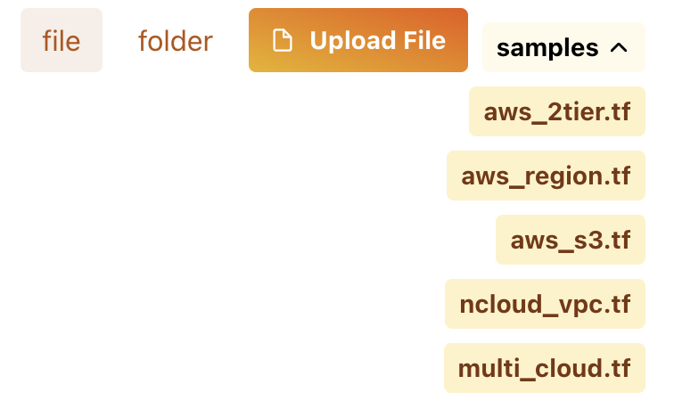
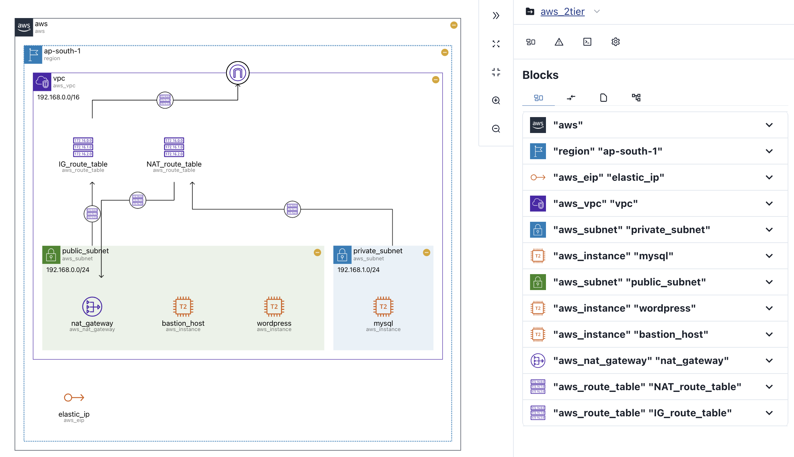

# Run Visualization

빠르고 가독성 좋은 정적 코드 시각화를 경험해보세요.

## Go to IaCDOG {#goto-iacdog}

  

[IaCDOG](https://www.initcloud.io/iacdog/visualizer)에 접속해주세요.

**로그인 없이** 바로 서비스 이용이 가능합니다.

## Upload your terraform module {#upload-your-terraform-module}

`terraform` 모듈(단일 파일 혹은 폴더)를 업로드 해주세요.

- **단일 파일**의 경우 `file`을, **폴더**의 경우 `folder`을 선택해 주세요.
- **샘플 파일**들을 통해 다양한 시각화 결과를 확인할 수 있습니다.

## 시각화 결과 확인 {#get-your-visualize-result}

- `terraform` 구조를 나타낸 **다이어그램**과, 상세 정보를 확인할 수 있는 **사이드바**가 제공됩니다.
- **다이어그램**과 **사이드바**는 서로 **인터랙티브**하게 연결되어 있어, 편리하게 리소스 정보를 확인할 수 있습니다.
