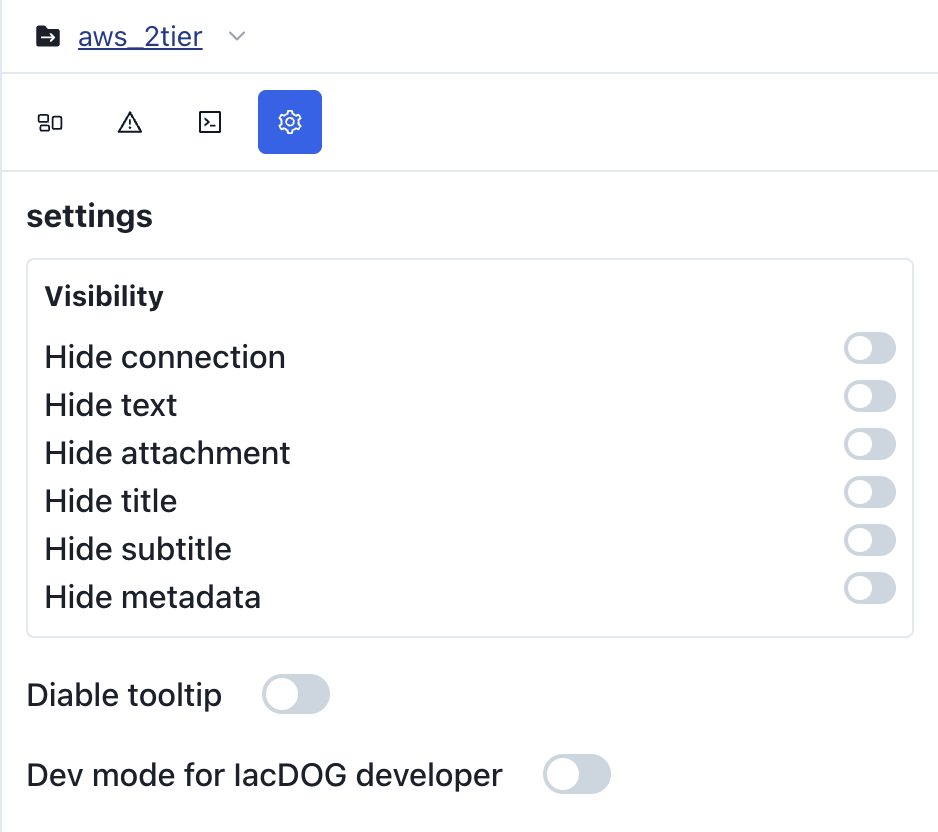
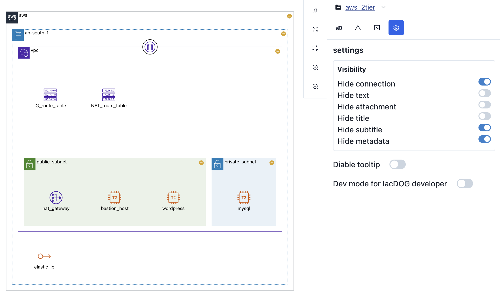
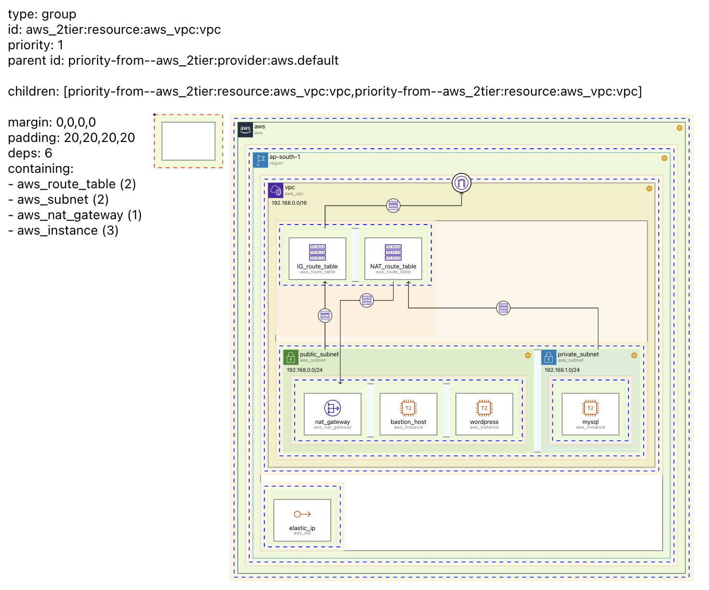

# Settings 탭

다이어그램과 관련한 다양한 **설정**을 제공합니다.

  

## Visibility {#visibility}

**Visibility** 설정을 이용하면 다이어그램의 다양한 정보를 숨길 수 있습니다.

## Disbale Tooltip {#disable-tooltip}

**툴팁**을 **활성화**하거나 **비활성화** 합니다.

## Dev mode for IacDOG developer {#dev-mode-for-iacdog-developer}

`IaCDOG` 개발 과정에서 사용하는 `dev` 모드입니다.

활성화 할 경우, 시각화 과정에서 정렬을 위해 생겨나는 모든 노드들이 보여집니다. 각 노드들에 마우스 커서를 올릴 경우 관련된 상세 정보들이 화면에 나타납니다.

:::info

`IaCDOG`은 아직 활발하게 **개발이 진행중인 프로젝트** 입니다. `dev` 모드는 개발이 안정화 되면 없어질 예정입니다. 재미있게 봐주세요!

:::
